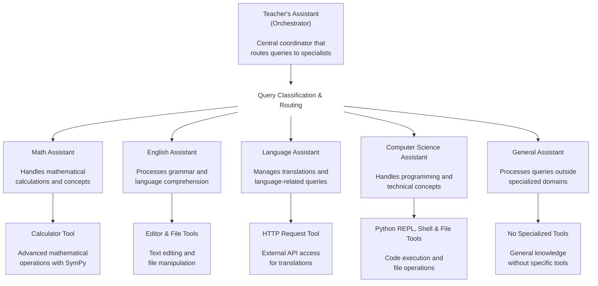

# Bedrock Multi-Agent System

This is a multi-agent system powered by Strands Agents that uses Amazon Bedrock for all model inference calls. The system demonstrates a sophisticated educational orchestrator where specialized agents work together under the coordination of a central Teacher's Assistant to provide expert responses across multiple subject domains.

## Prerequisites

### AWS Account and Bedrock Access
- Active AWS account with Amazon Bedrock access
- Access to Nova Pro model in your AWS region
- AWS credentials with Bedrock permissions

### Required Permissions
Your AWS credentials need the following permissions:
```json
{
    "Version": "2012-10-17",
    "Statement": [
        {
            "Effect": "Allow",
            "Action": [
                "bedrock:InvokeModel",
                "bedrock:InvokeModelWithResponseStream"
            ],
            "Resource": "arn:aws:bedrock:*::foundation-model/us.amazon.nova-pro-v1:0"
        }
    ]
}
```

## Installation and Setup

### 1. Install Dependencies
```bash
# Install Python dependencies
pip install -r requirements.txt

# Or if using the parent requirements:
pip install -r ../requirements.txt
```

### 2. Configure AWS Credentials
Choose one of these methods:

#### Option A: AWS CLI (Recommended)
```bash
aws configure
# Enter your AWS Access Key ID, Secret Access Key, and region
```

#### Option B: Environment Variables
```bash
export AWS_ACCESS_KEY_ID=your-access-key
export AWS_SECRET_ACCESS_KEY=your-secret-key
export AWS_SESSION_TOKEN=your-session-token  # If using temporary credentials
```

#### Option C: AWS Profile
```bash
export AWS_PROFILE=your-profile-name
```

### 3. Verify Bedrock Access
Ensure you have access to the Nova Pro model in your AWS region:
```bash
aws bedrock list-foundation-models --region us-west-2
```

## Quick Start

### 1. Run the Streamlit App

```bash
# Navigate to the multi_agent_example directory
cd workshop_4/strands_agents/multi_agent_example

# Start the Streamlit web interface
streamlit run app.py
```

### 2. Alternative: Test Individual Components

You can test individual agents directly:

```bash
python math_assistant.py
python english_assistant.py
python language_assistant.py
python computer_science_assistant.py
python no_expertise.py
```

## Configuration

### Current Configuration

The system is pre-configured with:
- **Model**: `us.amazon.nova-pro-v1:0` (Amazon Nova Pro)
- **Temperature**: `0.3` (balanced creativity and consistency)
- **Region**: `us-west-2`

### Model Configuration

The Bedrock model is configured in each agent file:

```python
bedrock_model = BedrockModel(
    model_id="us.amazon.nova-pro-v1:0",
    temperature=0.3,
)
```

## Architecture

The application includes:
- **Teacher's Assistant**: Central orchestrator that routes queries to specialized agents
- **Math Assistant**: Handles mathematical calculations and problems
- **English Assistant**: Processes grammar, writing, and literature tasks
- **Language Assistant**: Manages translations and language-related queries
- **Computer Science Assistant**: Handles programming questions and code execution
- **General Assistant**: Processes general queries outside specific domains

All agents use Amazon Bedrock's Nova Pro model for natural language understanding and generation.

## Architecture Diagram



## Troubleshooting

### Configuration Issues
If you encounter configuration errors:
1. Verify your AWS credentials are properly configured
2. Check that Bedrock service is available in your region
3. Confirm your AWS credentials have Bedrock permissions

### Common Issues

#### 1. "Access denied" or authentication errors
**Causes**:
- Missing AWS credentials
- Insufficient Bedrock permissions
- Model not available in your region

**Solution**:
- Run `aws sts get-caller-identity` to verify credentials
- Check IAM permissions for Bedrock access
- Verify Nova Pro model availability in your region

#### 2. "Model not found" errors
**Causes**:
- Model ID incorrect
- Model not available in your region
- Insufficient permissions

**Solution**:
- Verify model ID: `us.amazon.nova-pro-v1:0`
- Check available models: `aws bedrock list-foundation-models`
- Ensure you have access to Nova Pro in your region

#### 3. "Streamlit connection issues"
**Solution**:
- Ensure AWS credentials are properly configured
- Check that Bedrock service is available in your region
- Verify network connectivity to AWS services

### Getting Help

1. **Check AWS Configuration**: Run `aws configure list` to verify setup
2. **Test Bedrock Access**: Use AWS CLI to test model access
3. **Verify Credentials**: Run `aws sts get-caller-identity`
4. **Check Model Availability**: List available foundation models

## Example Configuration

For reference, here's a working configuration:
```bash
export AWS_ACCESS_KEY_ID=your-access-key
export AWS_SECRET_ACCESS_KEY=your-secret-key
export AWS_DEFAULT_REGION=us-west-2
```

## Development

For development and testing:
- Main orchestrator: `teachers_assistant.py`
- Streamlit interface: `app.py`
- Specialized agents: `*_assistant.py` files
- Windows utilities: `windows_tools.py`

## Next Steps

After successful setup, you can:
1. Use the Streamlit interface to interact with all agents
2. Ask mathematical questions (routed to Math Assistant)
3. Request translations (routed to Language Assistant)
4. Get programming help (routed to Computer Science Assistant)
5. Ask general questions (routed to General Assistant)

All responses will be generated using Amazon Bedrock's Nova Pro model with automatic CloudWatch logging.

### Advanced Features

The system includes hooks for future enhancements:
- Session memory for conversation history
- Additional domain-specific agents
- Agent collaboration capabilities
- Performance monitoring and metrics

See the code comments for implementation details.

## Important Notes

### Model Capabilities
- **Nova Pro**: Excellent for general reasoning and complex queries
- **Tool Calling**: Full support for all integrated tools
- **Context Length**: Suitable for complex multi-turn conversations
- **Performance**: Optimized for educational and professional use cases

### Cost Considerations
- Bedrock charges per token for input and output
- Monitor usage through AWS CloudWatch
- Consider using temperature settings to balance creativity and cost

## References

- [Strands Agents Documentation](https://strandsagents.com/)
- [Amazon Bedrock Documentation](https://docs.aws.amazon.com/bedrock/)
- [Nova Pro Model Guide](https://docs.aws.amazon.com/bedrock/latest/userguide/model-parameters-nova.html)