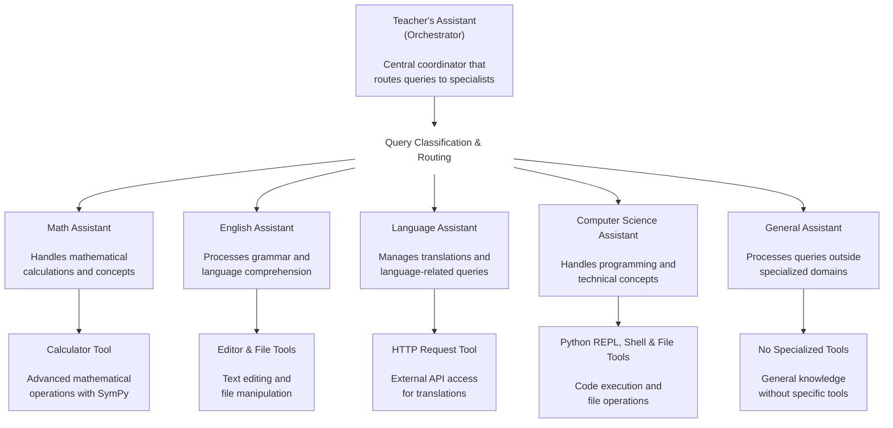

# Demo: Multi-Agent with Strands Agents (Amazon SageMaker JumpStart)

This is a multi-agent system powered by Strands Agents that uses Amazon SageMaker Inference Endpoints for all model inference calls. The system maintains the same functionality as the original multi_agent_example but routes all LLM requests through SageMaker endpoints.

## ⚠️ Critical: Model Compatibility

**This issue cost significant development time and should be clearly documented.**

### The Problem
When using SageMaker models with Strands Agents, you'll encounter this error with incompatible models:

```
ModelError: Received client error (422) from primary with message 
"{"error":"Template error: template not found","error_type":"template_error"}"
```

### Root Cause
The SageMaker provider is designed to work with models that support OpenAI-compatible chat completion APIs. During development and testing, the provider has been validated with Mistral-Small-24B-Instruct-2501, which demonstrated reliable performance across various conversational AI tasks.

### Compatible Models ✅
- **Mistral-Small-24B-Instruct-2501** (validated and recommended)
- **Models that support OpenAI-compatible chat completion APIs**

### Incompatible Models ❌
- **Open Llama 7b V2** (base model, no chat completion API support)
- **Other base/foundation models without OpenAI-compatible chat APIs**

### How to Verify Model Compatibility
1. Check if the model name contains "Instruct", "Chat", or similar
2. Look for chat template configuration in the model's tokenizer config
3. Test with a simple agent call - compatible models won't throw template errors

**Always use instruction-tuned models** when working with Strands Agents on SageMaker. This will save significant debugging time and ensure proper functionality.

## Prerequisites

### AWS Account and SageMaker Endpoint
- Active AWS account with SageMaker access
- Deployed SageMaker Inference Endpoint
- AWS credentials with SageMaker permissions

### Required Permissions
Your AWS credentials need the following permissions:
```json
{
    "Version": "2012-10-17",
    "Statement": [
        {
            "Effect": "Allow",
            "Action": [
                "sagemaker:InvokeEndpoint",
                "sagemaker:DescribeEndpoint"
            ],
            "Resource": "arn:aws:sagemaker:*:*:endpoint/*"
        }
    ]
}
```

## Installation and Setup

### 1. Install Dependencies
```bash
# Install Python dependencies
pip install -r requirements.txt

# Or if using the parent requirements:
pip install -r ../requirements.txt
```

### 2. Configure AWS Credentials
Choose one of these methods:

#### Option A: AWS CLI (Recommended)
```bash
aws configure
# Enter your AWS Access Key ID, Secret Access Key, and region
```

#### Option B: Environment Variables
```bash
export AWS_ACCESS_KEY_ID=your-access-key
export AWS_SECRET_ACCESS_KEY=your-secret-key
export AWS_SESSION_TOKEN=your-session-token  # If using temporary credentials
```

#### Option C: AWS Profile
```bash
export AWS_PROFILE=your-profile-name
```

### 3. Configure SageMaker Settings
```bash
# Set your SageMaker endpoint name (REQUIRED)
export SAGEMAKER_ENDPOINT_NAME=your-endpoint-name

# Optional: Set region (default: us-west-2)
export SAGEMAKER_REGION=us-west-2

# Optional: Enable verbose logging for debugging
export SAGEMAKER_VERBOSE_LOGGING=true
```

## Quick Start

### 1. Configure Your SageMaker Endpoint

**Important**: You must update the endpoint name before running the system.

1. Edit `setup_env.py` and replace the endpoint template:
   ```python
   # Change this line:
   endpoint_name = 'jumpstart-dft-hf-llm-mistral-small-{YYYYMMDD}-{HHMMSS}'
   
   # To your actual endpoint name, for example:
   endpoint_name = 'jumpstart-dft-hf-llm-mistral-small-20250908-025809'
   ```

2. Also update `tests/multi_agent_sagemaker/setup_test_env.py` with the same endpoint name.

### 2. Run the Streamlit App

```bash
# Navigate to the multi_agent_sagemaker directory
cd workshop_4/strands_agents/multi_agent_sagemaker

# Set up environment variables and test configuration
python setup_env.py
```

This will:
- Set the required SageMaker endpoint and authentication
- Validate the configuration
- Confirm the system is ready

After successful environment setup:

```bash
streamlit run app.py
```

### 3. Alternative: Test Individual Components

You can test individual agents directly:

```bash
python math_assistant.py
python english_assistant.py
python language_assistant.py
python computer_science_assistant.py
python no_expertise.py
```

## Configuration

The system requires these environment variables:

### Required
- `SAGEMAKER_ENDPOINT_NAME`: Your SageMaker inference endpoint name

### Optional
- `SAGEMAKER_REGION`: AWS region (default: us-west-2)
- `SAGEMAKER_TIMEOUT`: Request timeout in seconds (default: 30)
- `SAGEMAKER_MAX_RETRIES`: Maximum retry attempts (default: 3)
- `SAGEMAKER_VERBOSE_LOGGING`: Enable detailed logging (default: false)

### Current Configuration

The system uses environment variables for configuration. Use the `setup_env.py` script for easy setup, or set variables manually as shown in the configuration section above.

The `setup_env.py` script is pre-configured with:
- **Endpoint**: `jumpstart-dft-hf-llm-mistral-small-{YYYYMMDD}-{HHMMSS}` (replace with your actual endpoint)
- **Region**: `us-west-2`

## Architecture

The application includes:
- **Teacher's Assistant**: Central orchestrator that routes queries to specialized agents
- **Math Assistant**: Handles mathematical calculations and problems
- **English Assistant**: Processes grammar and writing tasks
- **Language Assistant**: Manages translations
- **Computer Science Assistant**: Handles programming questions
- **General Assistant**: Processes general queries

All agents use SageMaker Inference Endpoints for model inference instead of default Strands model providers.

## Architecture Diagram



## Troubleshooting

### Configuration Issues
If you encounter configuration errors:
1. Run `python setup_env.py` to check environment variables
2. Verify your SageMaker endpoint is active and accessible
3. Confirm your AWS credentials have SageMaker permissions

### Common Issues

#### 1. "SAGEMAKER_ENDPOINT_NAME environment variable is required"
**Solution**: Set the endpoint name
```bash
export SAGEMAKER_ENDPOINT_NAME=your-actual-endpoint-name
```

#### 2. "Endpoint not found"
**Causes**:
- Incorrect endpoint name
- Endpoint not deployed
- Wrong region

**Solution**: 
- Verify endpoint name in AWS Console
- Check endpoint status (InService)
- Confirm region matches

#### 3. "Access denied"
**Causes**:
- Missing AWS credentials
- Insufficient permissions

**Solution**:
- Run `aws sts get-caller-identity` to verify credentials
- Check IAM permissions for SageMaker access

#### 4. "Configuration test failed"
**Solution**: Run the setup script for detailed diagnostics
```bash
python setup_env.py
```

### SageMaker Endpoint Issues
- Ensure your endpoint is deployed and in service
- Check that your AWS credentials have the necessary SageMaker permissions
- Verify the endpoint is in the `us-west-2` region

### Streamlit Issues
- Always run `python setup_env.py` before `streamlit run app.py`
- Environment variables must be set in the same terminal session
- If the app fails to start, check the configuration test output

### Getting Help

1. **Check Configuration**: Run `python setup_env.py` for detailed status
2. **Test Connectivity**: Use the test scripts in `../tests/multi_agent_sagemaker/`
3. **Verify Credentials**: Run `aws sts get-caller-identity`
4. **Check Endpoint**: Verify in AWS SageMaker Console

## Example Configuration

For reference, here's a working configuration:
```bash
export SAGEMAKER_ENDPOINT_NAME=jumpstart-dft-hf-llm-mistral-small-{YYYYMMDD}-{HHMMSS}
export SAGEMAKER_REGION=us-west-2
export SAGEMAKER_VERBOSE_LOGGING=true
```

## Development

For development and testing:
- Configuration: `config.py`
- Tests: `../tests/multi_agent_sagemaker/`
- Environment setup: `setup_env.py`
- Example configuration: `.env.example`

## Next Steps

After successful setup, you can:
1. Use the Streamlit interface to interact with all agents
2. Ask mathematical questions (routed to Math Assistant)
3. Request translations (routed to Language Assistant)
4. Get programming help (routed to Computer Science Assistant)
5. Ask general questions (routed to General Assistant)

All responses will be generated using your SageMaker inference endpoint with automatic CloudWatch logging.

### Advanced Features

The system includes hooks for future enhancements:
- Specialized endpoints per agent type
- Advanced error handling and retry logic
- Performance monitoring and metrics
- Load balancing and failover

See the code comments for implementation details.

## Important Notes

### Tool Calling Support
Tool calling support varies by model. Models like Mistral-Small-24B-Instruct-2501 have demonstrated reliable tool calling capabilities, but not all models deployed on SageMaker support this feature. Verify your model's capabilities before implementing tool-based workflows.

### Time Investment Warning
⚠️ **Model compatibility issues can cause extensive debugging time.** Always verify model compatibility before beginning integration work.

## References

- [Strands Agents SageMaker Documentation](https://strandsagents.com/latest/documentation/docs/user-guide/concepts/model-providers/sagemaker/)