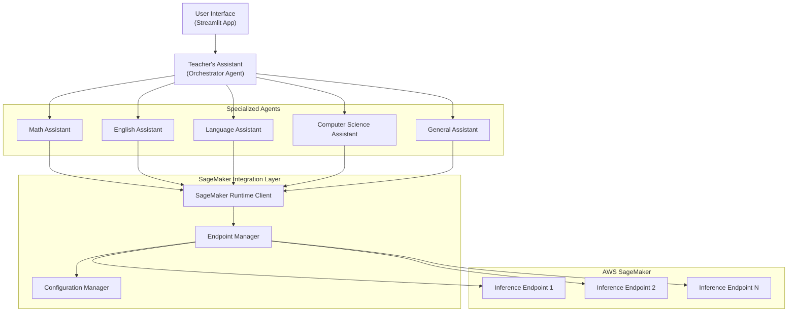

# Design Document

## Overview

The multi_agent_sagemaker system has been implemented as a multi-agent educational assistant that uses Amazon SageMaker Inference Endpoints for all model inference calls. The system features a central orchestrator (Teacher's Assistant) that coordinates five specialized agents, routing all LLM requests through SageMaker endpoints using the native Strands SDK SageMaker support.

This implementation provides enterprise-grade deployment with improved scalability, monitoring, and cost management while maintaining an intuitive Streamlit-based user interface for educational interactions.

## Architecture

### High-Level Architecture



### SageMaker Integration Architecture

The integration will be implemented through a custom model provider that wraps SageMaker Inference Endpoints:

1. **SageMaker Model Provider**: Custom implementation that conforms to Strands' model interface
2. **Endpoint Configuration**: Flexible configuration system for different endpoints and environments
3. **Authentication Management**: AWS credential handling with support for temporary credentials
4. **Error Handling**: Comprehensive error handling with retry logic and fallback mechanisms

## Components and Interfaces

### 1. SageMaker Model Integration

**Purpose**: Uses the native Strands SDK SageMaker support to integrate with Amazon SageMaker Inference Endpoints.

**Documentation Reference**: For complete details on Strands SageMaker integration, see the [official documentation](https://strandsagents.com/latest/documentation/docs/user-guide/concepts/model-providers/sagemaker/).

**Implementation**: The system uses `SageMakerAIModel` from `strands.models.sagemaker` with the following configuration:

```python
def create_sagemaker_model():
    """Create a SageMaker AI model using native Strands support."""
    endpoint_name = get_sagemaker_endpoint()
    region = get_aws_region()
    
    sagemaker_model = SageMakerAIModel(
        endpoint_config={
            "endpoint_name": endpoint_name,
            "region_name": region,
        },
        payload_config={
            "max_tokens": 1000,
            "temperature": 0.7,
            "stream": True,
        }
    )
    return sagemaker_model

def create_simple_agent(system_prompt: str, tools=None):
    """Create a Strands agent with SageMaker model."""
    sagemaker_model = create_sagemaker_model()
    agent = Agent(
        system_prompt=system_prompt,
        model=sagemaker_model,
        tools=tools or []
    )
    return agent
```

**Model Compatibility**: The system is designed to work with models that support OpenAI-compatible chat completion APIs. It has been validated with Mistral-Small-24B-Instruct-2501, which provides reliable performance and tool calling capabilities. For detailed model compatibility requirements, refer to the [Strands SageMaker documentation](https://strandsagents.com/latest/documentation/docs/user-guide/concepts/model-providers/sagemaker/).

### 2. Configuration Management

**Purpose**: Simple configuration system that manages SageMaker endpoint settings through environment variables.

**Implementation**: The `config.py` module provides straightforward configuration management:

```python
def get_sagemaker_endpoint():
    """Get SageMaker endpoint name from environment variable."""
    endpoint_name = os.getenv('SAGEMAKER_ENDPOINT_NAME')
    if not endpoint_name:
        raise ValueError("SAGEMAKER_ENDPOINT_NAME environment variable is required")
    return endpoint_name

def get_aws_region():
    """Get AWS region from environment variable."""
    return os.getenv('AWS_DEFAULT_REGION', 'us-west-2')
```

**Configuration Variables**:
- `SAGEMAKER_ENDPOINT_NAME` (required): SageMaker inference endpoint name
- `SAGEMAKER_REGION` (optional): AWS region, defaults to us-west-2
- `SAGEMAKER_VERBOSE_LOGGING` (optional): Enable detailed logging
- `SAGEMAKER_TIMEOUT` (optional): Request timeout in seconds
- `SAGEMAKER_MAX_RETRIES` (optional): Maximum retry attempts

**Current Configuration**: The system is pre-configured with:
- Endpoint: `jumpstart-dft-hf-llm-mistral-small-20250908-025809`
- Region: `us-west-2`
- Authentication: Uses default AWS credential chain

### 3. Agent Creation Pattern

**Purpose**: Simplified agent creation using the `create_simple_agent` function that integrates SageMaker models with Strands agents.

**Implementation**: Each specialized agent uses this pattern:
```python
def create_simple_agent(system_prompt: str, tools=None):
    """Create a Strands agent with SageMaker model."""
    sagemaker_model = create_sagemaker_model()
    agent = Agent(
        system_prompt=system_prompt,
        model=sagemaker_model,
        tools=tools or []
    )
    return agent
```

### 4. Specialized Agents

The system implements five specialized agents, each using SageMaker endpoints for model inference:

- **Math Assistant** (`math_assistant.py`): Handles mathematical calculations with calculator tool integration
- **English Assistant** (`english_assistant.py`): Processes grammar and writing tasks with file editing tools
- **Language Assistant** (`language_assistant.py`): Manages translations with HTTP request capabilities
- **Computer Science Assistant** (`computer_science_assistant.py`): Handles programming questions with Python REPL and shell tools
- **General Assistant** (`no_expertise.py`): Processes general queries with no specialized tools

**Agent Implementation Pattern**:
```python
@tool
def math_assistant(query: str) -> str:
    """Process math queries using SageMaker-enabled agent"""
    formatted_query = f"Please solve the following mathematical problem, showing all steps and explaining concepts clearly: {query}"
    
    try:
        print("Routed to Math Assistant (SageMaker)")
        math_agent = create_simple_agent(
            system_prompt=MATH_ASSISTANT_SYSTEM_PROMPT,
            tools=[calculator],
        )
        agent_response = math_agent(formatted_query)
        return str(agent_response)
        
    except Exception as e:
        return f"Error processing your mathematical query via SageMaker: {str(e)}"
```

## Data Models

### 1. SageMaker Integration

**Model Configuration**: The system uses the native Strands `SageMakerAIModel` which handles request/response formatting automatically. For implementation details and configuration options, see the [Strands SageMaker documentation](https://strandsagents.com/latest/documentation/docs/user-guide/concepts/model-providers/sagemaker/):

```python
sagemaker_model = SageMakerAIModel(
    endpoint_config={
        "endpoint_name": endpoint_name,
        "region_name": region,
    },
    payload_config={
        "max_tokens": 1000,
        "temperature": 0.7,
        "stream": True,
    }
)
```

### 2. Configuration Structure

**Simple Configuration**: The system uses a lightweight configuration approach:

```python
class Config:
    def __init__(self):
        self.endpoint_name = endpoint
        self.region = region
        self.verbose_logging = os.getenv('SAGEMAKER_VERBOSE_LOGGING', 'false').lower() == 'true'

class AWSConfig:
    def __init__(self):
        self.region = region
```

## Error Handling

### 1. Application-Level Error Handling

The system implements error handling at the agent level with informative error messages:

```python
try:
    print("Routed to Math Assistant (SageMaker)")
    math_agent = create_simple_agent(
        system_prompt=MATH_ASSISTANT_SYSTEM_PROMPT,
        tools=[calculator],
    )
    agent_response = math_agent(formatted_query)
    text_response = str(agent_response)

    if len(text_response) > 0:
        return text_response

    return "I apologize, but I couldn't solve this mathematical problem. Please check if your query is clearly stated or try rephrasing it."
except Exception as e:
    return f"Error processing your mathematical query via SageMaker: {str(e)}"
```

### 2. Configuration Error Handling

The configuration system provides clear error messages for missing or invalid settings:

```python
def get_sagemaker_endpoint():
    """Get SageMaker endpoint name from environment variable."""
    endpoint_name = os.getenv('SAGEMAKER_ENDPOINT_NAME')
    if not endpoint_name:
        raise ValueError("SAGEMAKER_ENDPOINT_NAME environment variable is required")
    return endpoint_name
```

### 3. Streamlit Application Error Handling

The main application gracefully handles import and runtime errors:

```python
try:
    from strands import Agent
    from sagemaker_model import create_simple_agent
    # ... other imports
    AGENTS_AVAILABLE = True
except ImportError as e:
    st.error(f"Could not import required modules: {e}")
    AGENTS_AVAILABLE = False
```

## Testing Strategy

### 1. Configuration Testing

**Configuration Validation** (`test_config.py`):
- Validates environment variable setup
- Tests configuration loading and error handling
- Provides clear feedback for setup issues
- Shows environment status for troubleshooting

### 2. Model Integration Testing

**SageMaker Model Testing** (`test_sagemaker_model.py`):
- Tests SageMaker model creation using native Strands support
- Validates agent creation with SageMaker integration
- Tests basic agent response functionality
- Handles different agent invocation methods

### 3. Agent-Specific Testing

**Individual Agent Tests**:
- `test_math_assistant.py`: Tests mathematical query processing
- `test_all_assistants.py`: Comprehensive testing of all specialized agents
- `test_error_handling.py`: Tests error scenarios and graceful degradation

### 4. Environment Setup and Validation

**Setup Testing** (`setup_env.py`):
- Automated environment variable configuration
- Configuration validation with clear feedback
- Integration with test suite for validation
- Support for both test and production configurations

### 5. Test Infrastructure

**Test Directory Structure**:
```
tests/multi_agent_sagemaker/
├── test_config.py              # Configuration validation
├── test_sagemaker_model.py     # Model integration tests
├── test_math_assistant.py      # Math agent specific tests
├── test_all_assistants.py      # All agents comprehensive test
├── test_error_handling.py      # Error scenario testing
└── setup_test_env.py          # Test environment setup
```

**Windows Compatibility**: The system includes `windows_tools.py` to handle Unix-specific module compatibility issues, ensuring cross-platform functionality.