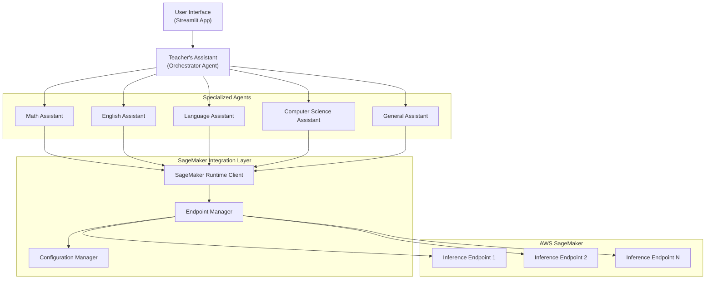

# Design Document

## Overview

The multi_agent_sagemaker system will be created by copying the existing multi_agent_example and integrating Amazon SageMaker Inference Endpoints for all model inference calls. The system maintains the same multi-agent architecture with a central orchestrator (Teacher's Assistant) coordinating specialized agents, but routes all LLM requests through SageMaker endpoints instead of the default Strands model configuration.

This design enables enterprise-grade deployment with improved scalability, monitoring, and cost management while preserving the existing user experience and functionality.

## Architecture

### High-Level Architecture



### SageMaker Integration Architecture

The integration will be implemented through a custom model provider that wraps SageMaker Inference Endpoints:

1. **SageMaker Model Provider**: Custom implementation that conforms to Strands' model interface
2. **Endpoint Configuration**: Flexible configuration system for different endpoints and environments
3. **Authentication Management**: AWS credential handling with support for temporary credentials
4. **Error Handling**: Comprehensive error handling with retry logic and fallback mechanisms

## Components and Interfaces

### 1. SageMaker Model Provider

**Purpose**: Custom model provider that integrates with Strands Agent framework to route inference requests to SageMaker endpoints.

**Key Methods**:
- `__init__(endpoint_name, region, credentials)`: Initialize with SageMaker configuration
- `generate(prompt, **kwargs)`: Send inference request to SageMaker endpoint
- `_prepare_payload(prompt, **kwargs)`: Format request payload for SageMaker
- `_parse_response(response)`: Parse SageMaker response to Strands format

**Interface**:
```python
class SageMakerModelProvider:
    def __init__(self, endpoint_name: str, region: str = None, credentials: dict = None):
        """Initialize SageMaker model provider"""
        
    def generate(self, prompt: str, **kwargs) -> str:
        """Generate response using SageMaker endpoint"""
        
    def _prepare_payload(self, prompt: str, **kwargs) -> dict:
        """Prepare request payload for SageMaker endpoint"""
        
    def _parse_response(self, response: dict) -> str:
        """Parse SageMaker response to text format"""
```

### 2. Configuration Manager

**Purpose**: Manage SageMaker endpoint configurations, AWS credentials, and environment-specific settings.

**Note**: SageMaker Inference Endpoints automatically log all requests and responses to Amazon CloudWatch. This includes model invocation logs, endpoint metrics, and error logs. No additional client-side configuration is required for CloudWatch logging.

**Configuration Sources**:
- Environment variables (primary)
- Configuration files (secondary)
- Runtime parameters (override)

**Configuration Schema**:
```python
{
    "sagemaker": {
        "region": "us-west-2",
        "endpoints": {
            "default": "my-llm-endpoint",
            "math": "my-math-specialized-endpoint",  # Optional specialized endpoints
            "language": "my-translation-endpoint"
        },
        "timeout": 30,
        "max_retries": 3
    },
    "aws": {
        "access_key_id": "...",  # Optional, can use IAM roles
        "secret_access_key": "...",
        "session_token": "..."  # For temporary credentials
    }
}
```

### 3. Agent Factory

**Purpose**: Factory pattern to create agents with SageMaker-enabled model providers.

**Interface**:
```python
class SageMakerAgentFactory:
    def __init__(self, config_manager: ConfigManager):
        """Initialize with configuration manager"""
        
    def create_agent(self, system_prompt: str, tools: list = None, 
                    endpoint_override: str = None) -> Agent:
        """Create agent with SageMaker model provider"""
```

### 4. Specialized Agents (Modified)

Each specialized agent will be updated to use the SageMaker model provider:

- **Math Assistant**: Uses SageMaker endpoint for mathematical reasoning
- **English Assistant**: Uses SageMaker endpoint for language and writing tasks
- **Language Assistant**: Uses SageMaker endpoint for translation tasks
- **Computer Science Assistant**: Uses SageMaker endpoint for programming assistance
- **General Assistant**: Uses SageMaker endpoint for general queries

**Modified Agent Pattern**:
```python
@tool
def math_assistant(query: str) -> str:
    """Process math queries using SageMaker-enabled agent"""
    try:
        print("Routed to Math Assistant (SageMaker)")
        
        # Create agent with SageMaker model provider
        math_agent = agent_factory.create_agent(
            system_prompt=MATH_ASSISTANT_SYSTEM_PROMPT,
            tools=[calculator],
            endpoint_override="math"  # Optional specialized endpoint
        )
        
        response = math_agent(formatted_query)
        return str(response)
        
    except Exception as e:
        return f"Error processing mathematical query via SageMaker: {str(e)}"
```

## Data Models

### 1. SageMaker Request/Response Models

**Request Payload**:
```python
{
    "inputs": "user prompt text",
    "parameters": {
        "max_new_tokens": 512,
        "temperature": 0.7,
        "top_p": 0.9,
        "do_sample": True
    }
}
```

**Response Format**:
```python
{
    "generated_text": "model response text",
    "metadata": {
        "finish_reason": "stop",
        "tokens_used": 150
    }
}
```

### 2. Configuration Models

**SageMaker Configuration**:
```python
@dataclass
class SageMakerConfig:
    region: str
    default_endpoint: str
    specialized_endpoints: Dict[str, str]
    timeout: int = 30
    max_retries: int = 3
    
@dataclass 
class AWSCredentials:
    access_key_id: Optional[str] = None
    secret_access_key: Optional[str] = None
    session_token: Optional[str] = None
    region: Optional[str] = None
```

## Error Handling

### 1. SageMaker-Specific Errors

**Endpoint Not Found**:
- Error Detection: HTTP 404 or specific SageMaker error codes
- Response: Clear message with endpoint name and suggested troubleshooting
- Fallback: None (fail fast with informative error)

**Authentication Errors**:
- Error Detection: HTTP 403 or AWS credential errors
- Response: Guide user to check AWS credentials and permissions
- Fallback: None (security-sensitive, fail fast)

**Rate Limiting**:
- Error Detection: HTTP 429 or throttling errors
- Response: Implement exponential backoff retry logic
- Fallback: Inform user of temporary unavailability

**Timeout Errors**:
- Error Detection: Request timeout or connection errors
- Response: Retry with exponential backoff (up to max_retries)
- Fallback: Inform user of endpoint unavailability

### 2. Error Handling Strategy

```python
class SageMakerErrorHandler:
    def handle_error(self, error: Exception, context: dict) -> str:
        """Handle SageMaker-specific errors with appropriate responses"""
        
    def should_retry(self, error: Exception) -> bool:
        """Determine if error is retryable"""
        
    def get_retry_delay(self, attempt: int) -> float:
        """Calculate exponential backoff delay"""
```

## Testing Strategy

### 1. Unit Testing

**SageMaker Model Provider Tests**:
- Mock SageMaker responses for different scenarios
- Test payload formatting and response parsing
- Test error handling for various failure modes
- Test credential handling and authentication

**Configuration Manager Tests**:
- Test configuration loading from different sources
- Test environment variable parsing
- Test configuration validation
- Test credential management

**Agent Factory Tests**:
- Test agent creation with different configurations
- Test endpoint override functionality
- Test error propagation

### 2. Integration Testing

**SageMaker Endpoint Integration**:
- Test actual SageMaker endpoint connectivity
- Test authentication with real AWS credentials
- Test different endpoint configurations
- Test error scenarios with real endpoints

**End-to-End Agent Testing**:
- Test each specialized agent with SageMaker integration
- Test orchestrator routing with SageMaker agents
- Test Streamlit interface with SageMaker backend
- Test concurrent request handling

### 3. Performance Testing

**Load Testing**:
- Test concurrent requests to SageMaker endpoints
- Measure response times and throughput
- Test rate limiting and retry behavior
- Test resource utilization

**Credential Testing**:
- Test with temporary AWS credentials
- Test credential expiration handling
- Test credential refresh scenarios
- Test different authentication methods (IAM roles, access keys)

### 4. Test Configuration

**Test Environment Setup**:
```python
# Test configuration for SageMaker integration
TEST_CONFIG = {
    "sagemaker": {
        "region": "us-west-2",
        "endpoints": {
            "default": "test-llm-endpoint"
        },
        "timeout": 10,
        "max_retries": 2
    }
}
```

**Mock SageMaker Responses**:
- Success responses with various content types
- Error responses for different failure scenarios
- Rate limiting and timeout scenarios
- Authentication failure scenarios

The testing strategy ensures comprehensive validation of the SageMaker integration while supporting development with temporary credentials and providing clear feedback for troubleshooting.